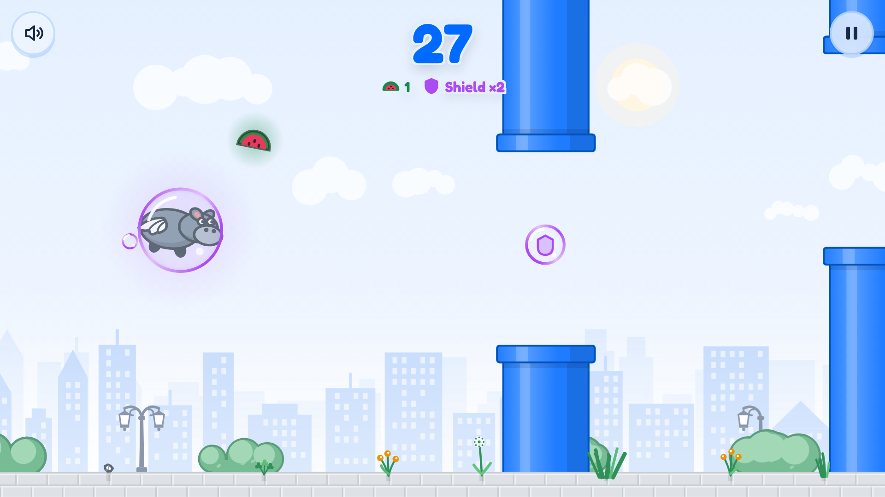

# Flappy Hippo

A flying hippo, one button, no account. Flappy Hippo runs entirely in the browser, installs on a
phone like an app, and works offline after the first visit.

**Play:** https://stekhn.github.io/flappy-hippo/



## Features

- **One control:** tap, click or Space.
- **Three difficulties** that get faster and tighter as the score climbs. From 100 points flower
  pots fall from the balconies, from 200 some pipes move up and down. Both are telegraphed and can
  be answered with skill: dying is never luck.
- **Melons and shields:** melons hang between the pipes and are worth three points; the bubble
  takes exactly one hit.
- **Records, medals and 22 achievements**, ten of them hidden until you get close. Everything is
  stored on the device; there is no server.
- **Pause with a count-in:** switching apps or taking a call never costs a round.
- **Day and night** with the system theme; **German or English** with the browser language.
- **A real app:** installable on phones and desktops, offline, with iOS splash screens, store-style
  screenshots in the install dialog, and app shortcuts. Updates are offered, never forced mid-round.

## Getting started

Requires Node 22 or newer.

```bash
npm install
npm run dev          # dev server at http://localhost:5173
npm run build        # static bundle in dist/
npm run preview      # serve the build under /flappy-hippo/
npm test             # game logic (Node test runner)
npm run lint         # oxlint
npm run assets       # assets/*.svg → icons, favicon, iOS splash screens
npm run screenshots  # manifest screenshots from the running app (needs Chrome, see below)
```

The build is a static site: put `dist/` on any web server. There are no network calls at runtime.

`npm run screenshots` looks for Chrome or Chromium in the usual places; point it elsewhere with
`CHROME_PATH=/path/to/chrome npm run screenshots`.

## Deployment

Every push to `main` builds and publishes to GitHub Pages via
[GitHub Actions](.github/workflows/deploy.yml). Once, in the repository settings, set
**Pages → Build and deployment → Source** to **GitHub Actions**.

The game is served as a project site under `/flappy-hippo/`; that path is the `base` in
[vite.config.ts](vite.config.ts). Change it to `/` for a user site or a custom domain, and update
the canonical and Open Graph URLs in [index.html](index.html).

## How it works

The core is a small, DOM-free simulation: `advance()` takes the state, a time step and the
world, and reports what happened. Around it sits a runtime that owns the canvas, the animation
frame and the input, and above that React for the HUD, the cards and the menu. React never
renders a frame; it receives a snapshot only when something it shows has changed.

The play field keeps a constant short side (320 world units) and lets the long side follow the
screen, so a gap is the same challenge on a portrait phone and a wide laptop. Still layers of
the backdrop are baked into bitmaps once and blitted at the scroll offset; only what moves is
drawn each frame. Resolution is capped at 2x and stepped down if a device cannot hold 60 fps.

The interface follows the browser's first language: German where that is German, English
otherwise. Strings live in [src/i18n](src/i18n), typed against the English catalogue.

## Project structure

```
src/game/          simulation, state, runtime, audio (no React)
src/game/render/   canvas drawing: hippo, pipes, backdrop, street, effects
src/components/    React UI: HUD, cards, menu
src/hooks/         runtime binding, settings, progress, install prompt
src/i18n/          message catalogues and locale detection
assets/            icon sources (SVG) for scripts/make-assets.ts
scripts/           asset and screenshot generation
```

## Origin

The game began as an easter egg on a maintenance page of an internal Next.js app and grew into a
standalone web app here: a portrait-friendly field, pickups, difficulties, sound, records,
achievements and offline play.
